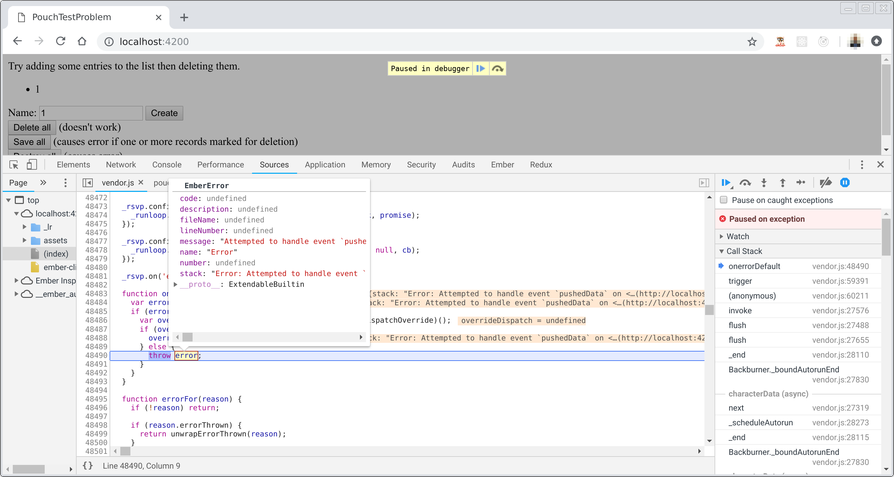

# ember-pouch-test-problem

There seems to be something wrong with `ember-pouch` v7.0.0 related to how it deletes/destroys records.
This simple example demonstrates the problem.

Steps to reproduce:

0. git clone https://github.com/jacobq/ember-pouch-test-problem.git
1. cd ember-pouch-test-problem
2. `yarn`
3. ember s
4. Open web browser and navigate to http://localhost:4200/
5. Enter "foo" (or anything really) into the "Name" input element and click "Create"
6. Click "Destroy all" (or "Delete all" then "Save all")
7. Open developer tools and observer error in console:

```text
Error: Attempted to handle event `pushedData` on <person:990E50DB-5036-B428-86ED-011A3F74EAEA> while in state root.deleted.inFlight. 
    at new EmberError (http://localhost:4200/assets/vendor.js:13635:31)
    at InternalModel._unhandledEvent (http://localhost:4200/assets/vendor.js:88837:13)
    at InternalModel.send (http://localhost:4200/assets/vendor.js:88685:14)
    at InternalModel.pushedData (http://localhost:4200/assets/vendor.js:88640:12)
    at InternalModel.setupData (http://localhost:4200/assets/vendor.js:88557:12)
    at Class._load (http://localhost:4200/assets/vendor.js:94423:21)
    at Class._pushInternalModel (http://localhost:4200/assets/vendor.js:94773:32)
    at internalModelOrModels._backburner.join (http://localhost:4200/assets/vendor.js:94720:38)
    at Backburner._run (http://localhost:4200/assets/vendor.js:28153:35)
    at Backburner._join (http://localhost:4200/assets/vendor.js:28131:29)"
```


